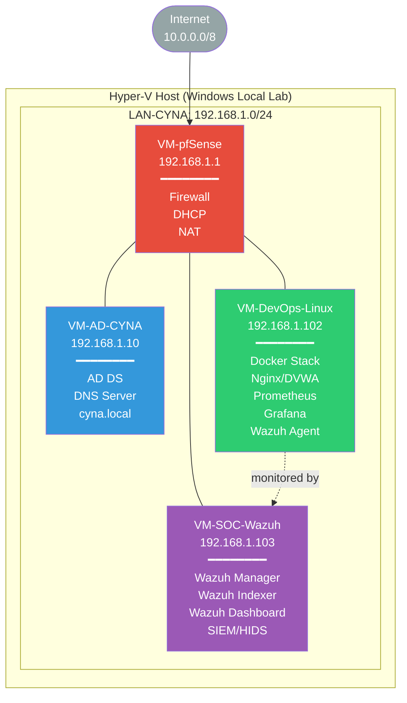
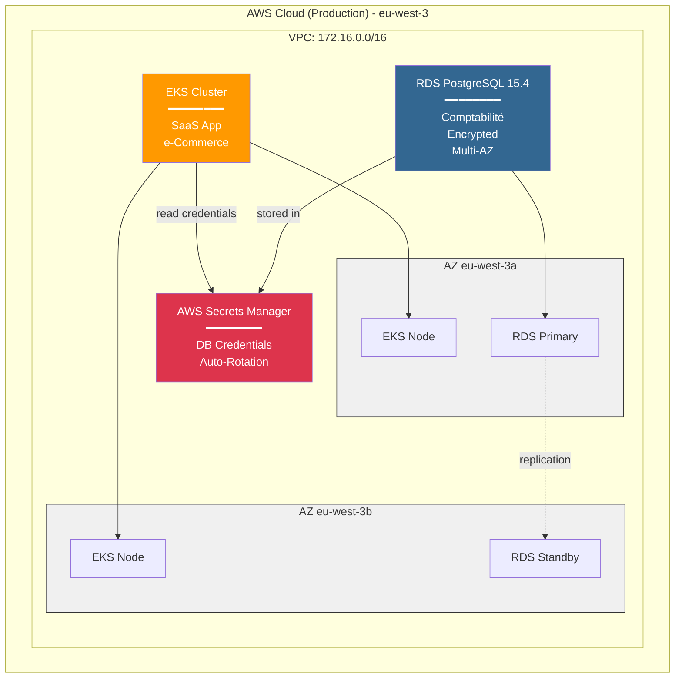

# CYNA-GROUP-2 - Infrastructure Security & Monitoring Lab


## Overview

Infrastructure hybride DevSecOps combinant :
- **Lab On-Premises (Hyper-V)** : pfSense, Active Directory, Wazuh, Docker Stack
- **Cloud Target (AWS)** : EKS, PostgreSQL RDS, Secrets Manager

## Features

- Infrastructure as Code (Terraform)
- Configuration Management (Ansible)
- Security Monitoring (Wazuh SIEM)
- Metrics & Monitoring (Prometheus, Grafana)
- Containerized Services (Docker Compose)
- CI/CD Pipeline (GitHub Actions)
- PostgreSQL RDS Multi-AZ
- AWS Secrets Manager

## Architecture

### Lab On-Premises (Hyper-V)



### Cloud Target (AWS)



## Project Structure

```
CYNA-GROUP-7/
├── .github/workflows/      # CI/CD pipelines
├── ansible/                # Configuration management
│   ├── inventories/        # Host inventories
│   ├── playbooks/          # Ansible playbooks
│   └── ansible.cfg         # Ansible configuration
├── docker/                 # Container orchestration
│   ├── prometheus/         # Prometheus config
│   └── docker-compose.yml  # Service definitions
├── terraform/              # Infrastructure as Code (AWS)
│   ├── aws-main.tf         # AWS Cloud infrastructure
│   ├── aws-variables.tf    # AWS variables
│   └── aws-outputs.tf      # AWS outputs
└── docs/                   # Documentation
    └── fiche_technique_lab.md
```

## Quick Start

### Prerequisites

- **Hyper-V** sur Windows (pour le lab local)
- **Terraform** >= 1.5.0 (pour déploiement AWS Cloud)
- **Ansible** >= 2.10
- **AWS CLI** configuré (pour le cloud target)
- **Docker** et Docker Compose
- **Accès SSH** aux VMs du lab

### Clone the Repository

```bash
git clone https://github.com/AbirLchk/CYNA-Group7.git
cd CYNA-Group7
```

### 2. Deploy Infrastructure with Terraform

Le lab Hyper-V est déjà en place localement. Voir [docs/LAB_HYPERV.md](docs/LAB_HYPERV.md).

#### AWS Cloud (EKS + RDS PostgreSQL)
```bash
cd terraform

# Initialize Terraform
terraform init

# Deploy AWS resources
terraform apply

# Get database credentials
aws secretsmanager get-secret-value \
  --secret-id $(terraform output -raw secrets_manager_secret_name) \
  --query SecretString --output text | jq .
```

See [terraform/README-AWS.md](terraform/README-AWS.md) for detailed guide.

### 3. Configure Wazuh Agents with Ansible

```bash
cd ../ansible

# Test connectivity
ansible all -m ping

# Deploy Wazuh agents
ansible-playbook playbooks/deploy-agent-wazuh.yml
```

### 4. Deploy Monitoring Stack

```bash
# Deploy Prometheus and Grafana
ansible-playbook playbooks/deploy-apps-monitoring.yml
```

### 5. Access Services

| Service | URL | Credentials | Location |
|---------|-----|-------------|----------|
| **Grafana** | `http://192.168.1.102:3000` | admin / admin | Lab Hyper-V |
| **Prometheus** | `http://192.168.1.102:9090` | - | Lab Hyper-V |
| **Wazuh Dashboard** | `https://192.168.1.103` | admin / j.InkeW0KXnvb*YNDs?Ks1.+2tO7cm5J | Lab Hyper-V |
| **PostgreSQL RDS** | Via Secrets Manager | See AWS outputs | AWS Cloud |

## PostgreSQL RDS

- Instance: db.t3.micro (Free Tier)
- Multi-AZ: 99.95% SLA
- Backups: Automatiques, rétention 7 jours
- Credentials: AWS Secrets Manager
- Coût estimé: ~$15-20/mois

## Configuration

### Terraform Variables

Edit `terraform/terraform.tfvars` (create if doesn't exist):

```hcl
# AWS Cloud Configuration
aws_region = "eu-west-3"
environment = "production"
prefix = "cyna7"
db_name = "comptabilite"
```

### Ansible Inventory

Edit `ansible/inventories/prod/hosts.ini` with your server IPs:

```ini
[wazuh]
wazuh-server ansible_host=YOUR_WAZUH_IP

[monitoring]
prometheus ansible_host=YOUR_PROMETHEUS_IP

[agents]
agent-01 ansible_host=YOUR_AGENT_IP
```

## Monitoring

### Default Dashboards

After deployment, Grafana comes with pre-configured dashboards for:
- 📈 System metrics (CPU, RAM, Disk)
- 🔒 Wazuh security alerts
- 🐳 Docker container metrics
- 🌐 Network traffic

### Prometheus Targets

Check scraping status: `http://<prometheus-ip>:9090/targets`

## Security

1. Changer les mots de passe par défaut
2. Restreindre l'accès SSH aux IPs connues
3. Activer SSL/TLS
4. Configurer les règles Wazuh
5. Rotation régulière des credentials

## Testing

Run the CI/CD pipeline locally:

```bash
# Terraform validation
cd terraform && terraform validate

# Ansible syntax check
cd ansible && ansible-playbook --syntax-check playbooks/*.yml

# Docker compose validation
cd docker && docker compose config
```

## Documentation

- [Quick Start](QUICKSTART.md)
- [AWS Deployment](terraform/README-AWS.md)
- [Technical Doc](docs/fiche_technique_lab.md)
- [Hyper-V Lab Details](docs/LAB_HYPERV.md)
- [Wazuh Official Docs](https://documentation.wazuh.com/)
- [Prometheus Docs](https://prometheus.io/docs/)
- [Grafana Docs](https://grafana.com/docs/)
- [AWS RDS PostgreSQL](https://docs.aws.amazon.com/AmazonRDS/latest/UserGuide/CHAP_PostgreSQL.html)
- [AWS Secrets Manager](https://docs.aws.amazon.com/secretsmanager/)

## Troubleshooting

### Wazuh Agent Not Connecting

```bash
# Check agent logs
tail -f /var/ossec/logs/ossec.log

# Restart agent
systemctl restart wazuh-agent
```

### Prometheus Not Scraping

```bash
# Verify config
docker exec prometheus promtool check config /etc/prometheus/prometheus.yml

# Reload config
curl -X POST http://localhost:9090/-/reload
```

## 🤝 Contributing

1. Fork the repository
2. Create a feature branch (`git checkout -b feature/amazing-feature`)
3. Commit your changes (`git commit -m 'Add amazing feature'`)
4. Push to the branch (`git push origin feature/amazing-feature`)
5. Open a Pull Request

## 📝 License

This project is licensed under the MIT License - see the LICENSE file for details.
